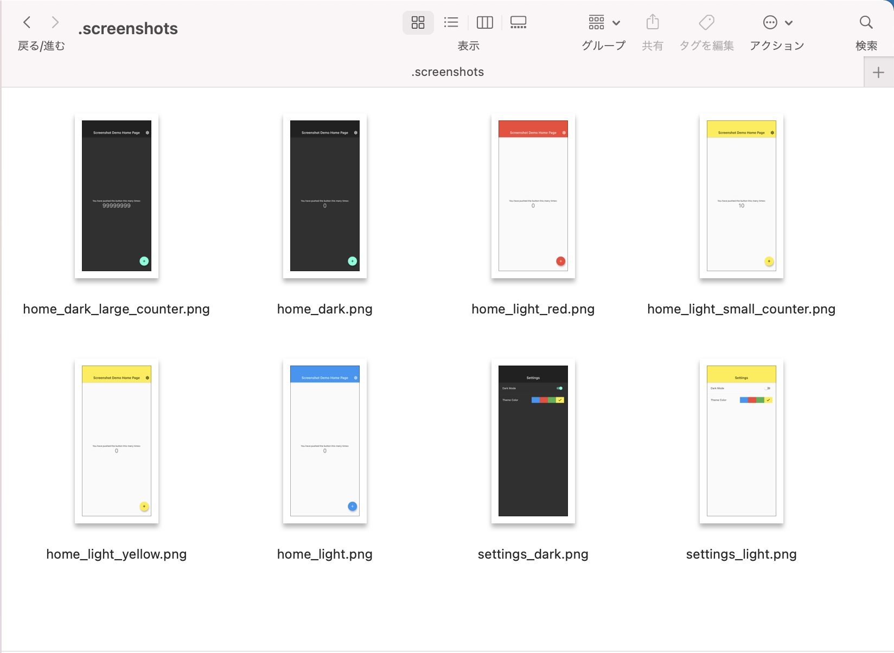

# Riverpodならアプリのスクリーンショット撮影も楽になるかも

次世代のProviderだと何かと話題のRiverpodに手を出しました。すっかり気に入って自作のアプリは全てRiverpodに書き換えてしまいました。

このRiverpodが提供するProviderにはOverrideという機能があります。

この記事ではこのOverrideを使って、手作業でやるには面倒なアプリのスクリーンショットを自動で撮ってみたいと思います。

# 概要

* Flutterアプリのスクリーンショットを自動で撮りたい
* Riverpodを使った実装なら好きな状態でスクリーンショットが撮れるかも

# Flutterのバージョン

```shell
% flutter --version
Flutter 1.25.0-8.1.pre • channel beta • https://github.com/flutter/flutter.git
Framework • revision 8f89f6505b (8 days ago) • 2020-12-15 15:07:52 -0800
Engine • revision 92ae191c17
Tools • Dart 2.12.0 (build 2.12.0-133.2.beta)
```

# サンプルアプリについて

リポジトリは[ここ](https://github.com/seiichi3141/take_screenshots.git)

メインのソースコードは一本にまとめました。
https://github.com/seiichi3141/take_screenshots/blob/master/lib/main.dart

* flutter createで作られるサンプルアプリをRiverpod仕様に実装し直して、テーマを変更できるようにしたもの
* 設定画面を用意する。テーマとダークモードの切替ができるようにする
* ホーム画面のAppBarのActionsにIconButtonを追加して設定画面へ遷移できる

Web用にビルドしたものが以下です。ダークモード、テーマ色の変更も確認できると思います。

<iframe width="375" height="667" src="http://blog.seiichirou.jp/take_screenshots/"></iframe>

## ライブラリ

riverpodやflutter_driverを追加しています。
```yaml
dependencies:
  flutter:
    sdk: flutter
  cupertino_icons: ^1.0.0
  flutter_riverpod: ^0.12.1

dev_dependencies:
  flutter_test:
    sdk: flutter
  flutter_driver:
    sdk: flutter
  test: any
```

## Providers

Primary Swatch, Brightness, CounterをStateProviderで管理します。
```dart
final primarySwatchProvider = StateProvider((_) => Colors.blue);
final brightnessProvider = StateProvider((_) => Brightness.light);
final counterProvider = StateProvider((_) => 0);
```

## Consumer

ConsumerでStateProviderを監視(watch)することでStateに変更があるたびにMaterialAppをRebuildしてくれるようになります。MaterialAppのテーマ変更はアニメーションがおまけでついてきます。
```dart
class MyApp extends StatelessWidget {
  @override
  Widget build(BuildContext context) {
    return Consumer(
      builder: (context, watch, _) {
        return MaterialApp(
          title: 'Screenshot Demo',
          debugShowCheckedModeBanner: false,
          theme: ThemeData(
            primarySwatch: watch(primarySwatchProvider).state,
            brightness: watch(brightnessProvider).state,
          ),
          home: MyHomePage(),
        );
      },
    );
  }
}
```

カウンター表示もこの通りConsumerで囲って監視します。
```dart
Consumer(
  builder: (context, watch, _) {
    return Text(
      '${watch(counterProvider).state}',
      style: Theme.of(context).textTheme.headline4,
    );
  },
),
```

## Stateの変更

FloatingActionButtonのAddボタンが押された時にcounterProviderのstateを更新します。
```dart
floatingActionButton: FloatingActionButton(
  onPressed: () => context.read(counterProvider).state++,
  tooltip: 'Increment',
  child: Icon(Icons.add),
),
```

設定画面では例えばSwitchの切り替えでbrightnessProviderのstateを変更します。
```dart
return SwitchListTile(
  title: const Text('Dark Mode'),
  value: watch(brightnessProvider).state == Brightness.dark,
  onChanged: (value) {
    if (value) {
      context.read(brightnessProvider).state = Brightness.dark;
    } else {
      context.read(brightnessProvider).state = Brightness.light;
    }
  },
);
```

今回はこのアプリのスクリーンショットを撮るのを目的とします。

# スクリーンショット撮影の流れ

スクリーンショットの撮影は基本的に以下の流れで行います。
* スクリーンショット用アプリの起動
* テストケース開始
* FlutterDriver.requestDataでアプリに変更をリクエスト
* スクリーンショット撮影

# Flutter Driver用にアプリを実装する

test_driverディレクトリにスクリーンショット撮影用のアプリapp.dartを実装します。

コードは[こちら](https://github.com/seiichi3141/take_screenshots/blob/master/test_driver/app.dart)

アプリにはホーム画面と設定画面の二つの画面があります。それを切り替えるために一つPrivderを用意します。

```dart
enum Screen {
  home,
  settings,
}

final screenProvider = StateProvider((_) => Screen.home);
```

Widgetで監視しているProviderを提供し、OverrideするためにProviderContainerを作っておきます。

```dart
final providerContainer = ProviderContainer(
  overrides: [
    screenProvider.overrideWithValue(
      StateController(Screen.home),
    ),
    primarySwatchProvider.overrideWithValue(
      StateController(Colors.blue),
    ),
    brightnessProvider.overrideWithValue(
      StateController(Brightness.light),
    ),
    counterProvider.overrideWithValue(
      StateController(0),
    ),
  ],
);
```

テストケースからFlutterDriver.requestDataで送られてくるデータを処理するenableFlutterDriverExtension関数を実装します。

[enableFlutterDriverExtension](https://api.flutter.dev/flutter/flutter_driver_extension/enableFlutterDriverExtension.html)

以下のコードは抜粋ですが、requestData('screen::settings')が送られたらscreenProviderをScreen.settingsでoverrideする。requestData('brightness::dark')が送られたらbrightnessProviderをBrightness.darkでoverrideするなど、スクリーンショットで撮りたい状況に合わせてProviderをoverrideできるようにしておきます。

```dart
  enableFlutterDriverExtension(
    handler: (action) async {
      switch (action) {
        case 'screen::settings':
          providerContainer.updateOverrides([
            screenProvider.overrideWithValue(
              StateController(Screen.settings),
            ),
          ]);
          break;
        case 'brightness::dark':
          providerContainer.updateOverrides([
            brightnessProvider.overrideWithValue(
              StateController(Brightness.dark),
            ),
          ]);
          break;
        case 'primarySwatch::yellow':
          providerContainer.updateOverrides([
            primarySwatchProvider.overrideWithValue(
              StateController(Colors.yellow),
            ),
          ]);
          break;
        case 'counter::large':
          providerContainer.updateOverrides([
            counterProvider.overrideWithValue(
              StateController(99999999),
            ),
          ]);
          break;
        default:
          break;
      }
      return '';
    },
  );
```

アプリの開始です。UncotrolledProviderScopeでproviderContainerをWidgetツリーに流し込みます。

```dart
  runApp(
    UncontrolledProviderScope(
      container: providerContainer,
      child: Consumer(
        builder: (context, watch, _) {
          Widget screen;
          switch (watch(screenProvider).state) {
            case Screen.settings:
              screen = SettingsScreen();
              break;
            default:
              screen = MyHomePage();
              break;
          }
          return MaterialApp(
            title: 'Screenshot Demo',
            debugShowCheckedModeBanner: false,
            theme: ThemeData(
              primarySwatch: watch(primarySwatchProvider).state,
              brightness: watch(brightnessProvider).state,
            ),
            home: screen,
          );
        },
      ),
    ),
  );
```

これでアプリ側は準備完了です。

# スクリーンショット撮影ユーティリティ

こーどは[こちら](https://github.com/seiichi3141/take_screenshots/blob/master/test_driver/screenshort.dart)

FlutterDriverにはスクリーンショット取得をするscreenshot関数が用意されています。これを利用しますが、アニメーション待ち、ディレクトリ作成、ファイル保存なども行いたいのでユーティリティーとして以下のような関数を用意します。

```dart
Future<void> takeScreenshot(FlutterDriver driver, String path) async {
  print('will take screenshot $path');
  await driver.waitUntilNoTransientCallbacks();
  final pixels = await driver.screenshot();
  final dir = Directory('.screenshots');
  if (!dir.existsSync()) {
    dir.createSync();
  }
  final file = File(join(dir.path, path));
  await file.writeAsBytes(pixels);
  print('wrote $file');
}
```

# テストケースを実装する

コードは[こちら](https://github.com/seiichi3141/take_screenshots/blob/master/test_driver/app_test.dart

最後にテストケースを実装します。FlutterDriverと接続して、requestDataで撮影したい状況に画面を更新した後にスクリーンショット撮影ユーティリティーでファイル化します。

以下は初期画面を撮影するケースです。

```dart
void main() {
  group('screenshots', () {
    FlutterDriver driver;

    setUpAll(() async {
      driver = await FlutterDriver.connect();
    });

    tearDownAll(() async {
      if (driver != null) {
        await driver.close();
      }
    });

    test('home light', () async {
      await driver.requestData('brightness::light');
      await takeScreenshot(driver, 'home_light.png');
    });
  });
}
```

他にも例えばダークモードで特定のカウンタの状況を写したい場合、設定画面を写したい場合など柔軟に撮影が可能です。

カウンターが99999999の状態を写したい場合など、実際にタップ操作で起こすのが困難なケースでもRiverpodでstateを管理していればすぐに実現可能です。

```dart
    test('home dark large counter', () async {
      await driver.requestData('brightness::dark');
      await driver.requestData('counter::large');
      await takeScreenshot(driver, 'home_dark_large_counter.png');
    });

    test('settings dark', () async {
      await driver.requestData('brightness::dark');
      await driver.requestData('screen::settings');
      await takeScreenshot(driver, 'settings_dark.png');
    });
```

# Flutter Driverを実行

シミュレータを起動し、以下のコマンドでDriverを実行します。

```shell
% flutter driver --target=test_driver/app.dart
```

以下は撮影をしている様子です。スクリーンが変わっていきます。

<iframe width="214" height="463" src="https://www.youtube.com/embed/3m6JVwjGpZM" frameborder="0" allow="accelerometer; autoplay; clipboard-write; encrypted-media; gyroscope; picture-in-picture" allowfullscreen></iframe>

指定したディレクトリには撮影した画像が残ります。



以上です。

# まとめ

Widgetに与えるデータによって見た目が変わる要素をRiverpodで管理できていればスクリーンショットも撮りやすい。

UIをフレキシブルに変えられるFlutterだからこそ、リリースするアプリのスクリーンショットはいつでも簡単に撮影できるようにしておくとリリース時の手間も大きく減らせると思います。
